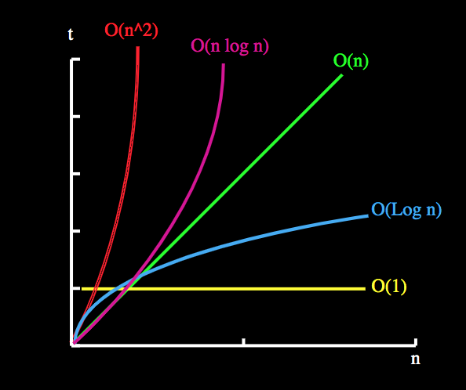

# Data structures and algorithms

It'll be useful to install node and to [clone this repo](https://github.com/NodeSchoolSF/interview-prep) to run some of the code interactively:

```bash
brew install node
git clone git@github.com:NodeSchoolSF/interview-prep.git
```

It will also be useful to have a free account on [Leetcode](https://leetcode.com/) so we can submit solutions to problems.


## Big O analysis

Big O characterizes (1) how long a function takes to run, or (2) how much memory/space the function uses, as the size of its input increases.



To make things concrete, let's analyze the big O of a solution to the [Valid Anagram](https://leetcode.com/problems/valid-anagram/) problem. First, let's consider a solution where we sort the strings:

```js
function isAnagram(source, target) {
  if (source.length !== target.length) {
    return false;
  }

  const sourceArr = source.split('');
  sourceArr.sort();

  const targetArr = target.split('');
  targetArr.sort();

  // If the two sorted strings are the same, then they're anagrams of each other.
  return sourceArr.join('')  === targetArr.join('');
}
```

The big O runtime is O(n log n), because sorting an array generally takes O(n log n) time (and we call it twice with `.sort()`). What is "n"? It's the length in characters of both source and target strings.

The leetcode submission runtime is 100ms, faster than 34% of other JS solutions. Can we do better? With the right insight - that two anagrams have the same character count - we can. We also rely on the fact that in a hash table, setting a value and retrieving a value are O(1) operations.

```js
function isAnagram(source, target) {
  if (source.length !== target.length) {
    return false;
  }
  const sourceArr = source.split('');
  const targetArr = target.split('');
  const charCounts = {};

  // Count how many times each character occurs in source str
  sourceArr.forEach((char) => {
    charCounts[char] = charCounts[char] || 0;
    charCounts[char] += 1;
  });

  // Iterate through target str, decrementing the counts for
  // each char seen.
  targetArr.forEach((char) => {
    charCounts[char] = charCounts[char] || 0;
    charCounts[char] -= 1;
  });

  // If all characters' counts are now 0, then each string has the
  // same number of each character, and are therefore anagrams.
  return Object.keys(charCounts).every((key) => {
    return charCounts[key] === 0;
  });
}
```

The big O runtime is O(n) because we make 5 sets of O(n) computations. If we submit it in Leetcode, we can see that the runtime has been improved from the previous solution.

Let's group up into pairs and work together to solve [Contains duplicate](https://leetcode.com/problems/contains-duplicate), and try to get a solution that passes the Leetcode online judge.


Concepts:

* Applies to both runtime and space
* Can involve "amortization", e.g. with hash tables implemented with dynamic arrays
* Binary search is log(n)
* Not always "n": can have multiple input sizes (e.g. two arrays, array of strings of different lengths)
* Space usage with recursion is O(number of stack frames).
* Sorting in general is O(n log n), but can be faster with specific inputs.

References:

- Cracking the Coding Interview, Ch. IV
- [Coding Interview University](https://github.com/jwasham/coding-interview-university#algorithmic-complexity--big-o--asymptotic-analysis)

## Data structures

I've highlighted some relevant Leetcode questions for each type of data structure.

Essential:

- **Arrays and Strings**
  - Big O: random access, append, delete `TODO`
  - Leetcode questions: [arrays](https://yangshun.github.io/tech-interview-handbook/algorithms/array/#recommended-leetcode-questions), [strings](https://yangshun.github.io/tech-interview-handbook/algorithms/string/#recommended-leetcode-questions)
  - References:
    - Cracking the Coding Interview, Ch. 1
- **Hash tables**
  - Big O: O(1) lookup, O(1) insert amortized
  - In javascript, objects act like hash tables (`{ key: value }`)
- **Linked lists**
  - Can implement as `class ListNode { value: any, next: ListNode | null, prev: ListNode | null }`
  - Concepts: know how to implement a Node class, singly vs doubly linked, deletion, [two "runner" technique](https://leetcode.com/problems/linked-list-cycle/solution/)
  - Sometimes solutions can be simplified by having dummy head/tail elements (see [LRU cache solution](https://leetcode.com/problems/lru-cache/solution/))
  - [Leetcode questions](https://yangshun.github.io/tech-interview-handbook/algorithms/linked-list/#recommended-leetcode-questions)
    - [Merge two sorted lists](https://leetcode.com/problems/merge-two-sorted-lists/)
- **Stacks and Queues**
  - Big O: `TODO`
    - Stacks: push/pop
    - Queues: enqueue/dequeue
  - In javascript, stacks can be implemented with arrays (`const stack = []; stack.push(item); stack.pop();`)
  - Concepts:
    - Know how to write a Stack or Queue with a linked list
    - Know how to use a stack to implement recursive algorithms iteratively
  - References:
    - Cracking the Coding Interview, Ch. 3
  - Leetcode questions:
    - [Valid parentheses](https://leetcode.com/problems/valid-parentheses/)
- **Trees**
  - Big O: find, insert, delete `TODO`
  - Concepts: binary tree traversal (in-order, pre-order, post-order), binary search
  - Can implement as `class TreeNode { value: any, children: TreeNode[] }`, or `class TreeNode { value: any, left: TreeNode | null, right: TreeNode | null }` for binary trees. Can also implement as an array.
  - References:
    - Cracking the Coding Interview, Ch. 4
    - [Tech interview handbook](https://yangshun.github.io/tech-interview-handbook/algorithms/tree)
  - Leetcode questions:
    - [Maximum depth of binary tree](https://leetcode.com/problems/maximum-depth-of-binary-tree/)
    - [Invert binary tree](https://leetcode.com/problems/invert-binary-tree/)
- **Graphs**
  - **Depth-first search (DFS)**: explore a branch fully before going to other neighbors. Simpler than BFS. Can be implemented recursively, or with a stack.
    - [Evaluate division](https://leetcode.com/problems/evaluate-division/)
    - [Number of islands](https://leetcode.com/problems/number-of-islands/)
    - [N-queens](https://leetcode.com/problems/n-queens/)
  - **Breadth-first search (BFS)**: visit all neighbors before going to any deeper neighbors. Can be used to find shortest path. Uses a queue.
    - [Binary tree level order traversal](https://leetcode.com/problems/binary-tree-level-order-traversal/)
  - **Detecting cycles**
    - [Course schedule](https://leetcode.com/problems/course-schedule/)
  - There are many ways to represent a graph in code. It's good to develop intuition on what can be abstractly translated into a graph problem (e.g. a maze).
    - Adjacency list (most common): can simply use a hash table that maps nodes (keys) to neighbors (value array): `{ 0: [1, 2], 2: [3, 5], ... }`
    - List of edges (undirected graph): `[(0, 1), (0, 3), (1, 5), ...]`
    - [2D matrixes](https://leetcode.com/problems/pacific-atlantic-water-flow/discuss/438276/Python-beats-98.-DFS-template-for-Matrix)
  - References:
    - Cracking the Coding Interview, Ch. 4
    - [Tech interview handbook](https://yangshun.github.io/tech-interview-handbook/algorithms/graph)
  - Leetcode questions:
    - [Course schedule](https://leetcode.com/problems/course-schedule/)

Less common:

- Tries
  - A type of tree, can appear in string search and prefix search problems. Improves efficiency of searching for a length-k string among n strings from O(n) to O(k).
  - [Leetcode questions](https://yangshun.github.io/tech-interview-handbook/algorithms/trie/)
  - References:
    - [Tech interview handbook](https://yangshun.github.io/tech-interview-handbook/algorithms/trie)
- Heaps
  - Big O: insert, extract min/max `TODO`


## Problem solving techniques

- **Greedy algorithms**
  - Technique: Sliding windows
    - [Longest substring without repeating characters](https://leetcode.com/problems/longest-substring-without-repeating-characters/)
    - [Longest repeating character replacement](https://leetcode.com/problems/longest-repeating-character-replacement/)
    - [Minimum window substring](https://leetcode.com/problems/minimum-window-substring/)
  - [Best time to buy and sell stock](https://leetcode.com/problems/best-time-to-buy-and-sell-stock/)
  - [Container with most water](https://leetcode.com/problems/container-with-most-water/)
- **Recursion**
  - Recursion is a very natural approach to tree problems.
  - Concepts: recursion helpers
- Dynamic programming
  - If a brute force solution isn't obvious, think about whether you could solve the problem if you knew the answer for a subset of the input.
  - [Coin change](https://leetcode.com/problems/coin-change/)
  - [Climbing stairs](https://leetcode.com/problems/climbing-stairs/)
- Preprocessing
  - You sometimes want to sort the input, or otherwise process it in a way that it'll make the main logic more efficient.
  - [Non-overlapping intervals](https://leetcode.com/problems/non-overlapping-intervals/)
- Combining data structures
  - Sometimes, you can find an efficient implementation by combining existing data structures, or having multiple of the same data structure. A well-known example is to [combine a hashtable and linked list to build an LRU cache](https://leetcode.com/problems/lru-cache/).
- Intervals
  - [See "merge intervals"](https://hackernoon.com/14-patterns-to-ace-any-coding-interview-question-c5bb3357f6ed)


## Applying concepts to real problems

**Greedy algorithms**

Let's go through [Best time to buy and sell stock](https://leetcode.com/problems/best-time-to-buy-and-sell-stock/).

There's a brute force O(n^2) solution where you compare every 2 elements and record the price difference. We get O(n^2) because we iterate through n + (n - 1) + (n - 2) + ... + 1 pairs, which sums to (n + 1) * (n / 2) = (n^2 + n) / 2, which is proportional to n^2.

```js
function maxProfit(prices) {
  let maxProfitValue = 0;
  for (let i = 0; i < prices.length; i++) {
    for (let j = i + 1; j < prices.length; j++) {
      const profit = prices[j] - prices[i];
      maxProfitValue = Math.max(maxProfitValue, profit);
    }
  }
  return maxProfitValue;
}
```

How can we do better?

Well, let's take a look at each time we see a new minimum stock value. Going forward, we no longer need to consider any values to the left of this new minimum - because any price difference to the right will strictly be better starting from this new minimum. This is a trademark of greedy algorithms - we don't need to "backtrack" and we can discard parts of the input. We should keep track of what the biggest price difference had been, though, in case it was higher.

Let's illustrate this by simulating what happens with some test cases:

```js
[5, 20, 4, 10, 3, 10]  // Biggest diff at beginning
[5, 20, 4, 10, 3, 20]  // Biggest diff at end
```

At this point, we can also ask the interviewer more details about the question:

* Will the price array have negative numbers? (let's assume no)
* Should we report a negative profit if prices keep descending? (let's assume no)

Okay, now let's code it up:

```js
function maxProfit(prices) {
  let maxProfitValue = 0;
  let minPrice = prices[0];

  prices.forEach((price) => {
    if (price < minPrice) {
      // Set new minimum
      minPrice = price;
    } else {
      // Track whether profit increases against current minimum
      maxProfitValue = Math.max(maxProfit, price - minPrice);
    }
  });

  return maxProfit;
}
```

Let's also think about some more edge cases to test:

```js
[]
[5, 4, 3, 2, 1]
```

You can run `node solutions/best_time_to_buy_and_sell_stock.js` to see how I set up testing this function out locally. We can also now submit the solution on Leetcode.

Big O analysis: we do an O(n) pass. We keep track of two variables, so O(1) storage.

This demonstrates a "greedy algorithm", where we can go from O(n^2) to O(n) runtime by having an insight that allows us to make a single pass through the input. Note that a greedy approach doesn't always work. If we change the problem slightly and ask for the [Longest increasing subsequence](https://leetcode.com/problems/longest-increasing-subsequence/), we can no longer discard earlier inputs when we see new minimums, because they can still factor in going forward. It's important to recognize when you can use a greedy approach, and when you can't.

**Recursion and trees**

Trees are represented by "nodes" which can have "children".


In code, this tree could be represented as:

```js
{
  // Root node: 2
  value: 2,
  left: {
    // Node with value 7
    value: 7,
    left: {
      // Node with value 2, a "leaf" node
      value: 2,
      left: null,
      right: null,
    },
    right: {
      // Node with value 6
      value: 6,
      // ...children 5 and 11...
    },
  },
  right: {
    // Node with value 5
    value: 5,
    left: null,
    right: {
      // Node with value 9
      value: 9,
      left: {
        // Leaf node with value 4
        value: 4,
        left: null,
        right: null,
      },
      right: null,
    }
  }
}
```

Let's solve [Maximum depth of binary tree](https://leetcode.com/problems/maximum-depth-of-binary-tree/). With a tree problem, always consider: if we solve the problem for the children of the root node, could we answer the question for the whole tree?

Suppose we know that the left child of a tree has max depth 5, and right child has max depth 7. What's the max depth of the tree?

Let's code it up:

```js
// Leetcode's definition of a tree node. Just like a plain object,
// but implemented as a class instead.
function TreeNode(val) {
  this.val = val;
  this.left = null;
  this.right = null;
}

function maxDepth(node) {
  // Base case
  if (!node) {
    return 0;
  }

  // Use recursion - call the same function on the two child nodes.
  // Recursion will eventually end because we're calling on successively smaller inputs.
  const leftDepth = maxDepth(node.left);
  const rightDepth = maxDepth(node.right);

  return Math.max(leftDepth, rightDepth) + 1;  // Add 1 to the max child depth
}
```

Let's try testing this. Take a look at [solutions/maximum_depth_of_binary_tree.js](solutions/maximum_depth_of_binary_tree.js).

After doing this, you can try implementing [Same tree](https://leetcode.com/problems/same-tree/) on your own.

**Tree traversal**

How do we list out all the nodes in a tree?

Let's think about it recursively. Assume we can list out the left and right subtrees - now what would we need to do to list the whole tree?

Let's solve [Binary tree inorder traversal](https://leetcode.com/problems/binary-tree-inorder-traversal/), without worrying about the "binary tree" or "inorder" parts of it yet.

```js
function inorderTraversal(root) {
  const visited = [];
  traverse(root, visited);
  return visited;
};

function traverse(node, visited) {
  // Handle base case - nodes with no children.
  if (!node) {
    return;
  }
  traverse(node.left, visited);
  visited.push(node.val);
  traverse(node.right, visited);
}
```

We can simulate this code on some example trees, and keep track of what `visited` looks like at each step.

This is an example of depth-first traversal, which is an important concept in both trees and graphs.

**Binary search trees (BSTs)**

Let's try solving [Search in a binary search tree](https://leetcode.com/problems/search-in-a-binary-search-tree/).

Binary search trees are a special type of binary tree, where all the values in a node's left subtree are lower than the node's value, and all the values in the right are higher.

This allows us to do binary search. Let's simulate this on a tree, e.g. [4, 2, 7, 1, 3].

What's the big-O runtime of binary search? We can always find a value in the tree with a number of comparisons equal to the "depth" of the tree. If we have n nodes in the tree, how many comparisons is that?

To figure this out, let's look at how many nodes we can fill at each possible tree depth.

| Depth | Max nodes |
1 | 1
2 | 3
3 | 7
4 | 15
5 | 31
6 | 63

Can you see a pattern? `nodes = 2^depth - 1`. So you can also say `depth = log2(nodes + 1)`. The number of comparisons to find a node, or the depth, is therefore O(log n).

**Graphs and depth-first search**

Suppose we have a graph, represented by a hash table mapping from nodes to neighbors:

```js
const testGraph = {
  1: [2, 3],
  2: [4],
  4: [1, 6],
  6: [],
}
```

Let's do a depth-first search of this graph and look for the node "6":

```js
function dfs(graph, node, targetNode, visitedNodes) {
  if (node == null) {
    return false;
  }

  // Don't revisit a node that has already been visited
  if (visitedNodes.includes(node)) {
    return false;
  }

  // Mark node as visited
  visitedNodes.push(node);

  // Check if targetNode is found
  if (node === targetNode) {
    return true;
  }

  // Get the neighbors of the node
  const neighbors = graph[node] || [];

  // Recursively do depth-first search on each of the node's neighbors.
  // If any of the neighbors finds the node, then return true (using .some)
  for (let i = 0; i < neighbors.length; i++) {
    const found = dfs(graph, neighbors[i], targetNode, visitedNodes);
    if (found) {
      return true;
    }
  }
  return false;
}
```

Let's try it out. Run `node algorithms/depth_first_search.js`.

**Graph applications**

Graphs can be represented in a wide number of ways (adjacency lists, list of edges, and 2D matrixes), and can also appear in very abstract representations. If a set of items relate to each other, it can probably be represented as a graph (e.g. plane tickets from various cities).

Let's solve a real problem using graphs and depth-first search: [Course schedule](https://leetcode.com/problems/course-schedule/).


## References

  [**14 patterns to ace any coding interview question**](https://hackernoon.com/14-patterns-to-ace-any-coding-interview-question-c5bb3357f6ed)
- [kdn251/interviews](https://github.com/kdn251/interviews) - overview of algorithms and data structures, prep resources, and problem solutions in Java
- [yangshun/lago](https://github.com/yangshun/lago) - data structures and algorithms in JS

## Next section

[**Next: Technical phone screen and whiteboarding practice**](technical_phone_screen_and_whiteboarding_practice.md)
